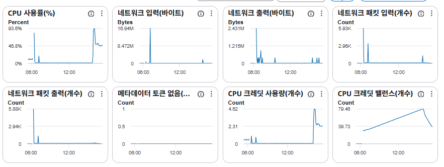
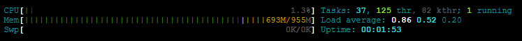

# EC2 서버 배포 후 10분 만에 다운되는 문제 해결하기

ec2에 애플리케이션 배포 직후 EC2 인스턴스가 응답 불능 상태에 빠지는 현상의 원인을 메모리 부족
(OOM)으로 확정하고, 호스트·컨테이너·JVM 세 계층에 걸쳐 메모리 방어선을 다시 설계해 해결한
과정을 정리한다.

## 문제 상황

배포 파이프라인(GitHub Actions → ECR → EC2)으로 Spring Boot 애플리케이션을 배포하면,
10분 이내에 EC2 인스턴스 자체가 응답 불능 상태가 되는 현상이 반복됐다. CloudWatch 대시보드에는
두 가지 단서가 있었다.

- **CPU 사용률**이 배포 시점에 93.6%까지 치솟고, CPU 크레딧 밸런스가 하루 종일 쌓아온 79개를
  순식간에 소진했다.
  
- 다운된 인스턴스에 다시 접속해 `htop`을 확인하면, 부팅한 지 1분 53초 만에 이미 물리 메모리
  955MB 중 693MB(72%)를 쓰고 있었고, **swap은 0/0으로 아예 설정되어 있지 않았다.**
  

### 로컬 실측으로 문제 원인 확정하기

로컬 JVM에 `-XX:MaxRAM=955m` 플래그로 t2.micro와 동일한
메모리 조건을 강제로 주입하고, 배포용 jar를 그대로 완전 기동시켜 NMT(Native Memory Tracking)와
OS 레벨 RSS를 함께 측정했다. 그 결과 유휴 상태의 애플리케이션만으로도 약 414MB(힙 157MB +
논힙 253MB)를 점유했고, 여기에 Redis와 OS/Docker 기본 사용량을 더하면 약 694MB가 나와, 실제
장애 당시 관찰했던 `htop`의 `693MB/955MB`와 사실상 일치했다. 이 측정으로 다음 세 가지 방어막이
동시에 없다는 것을 원인으로 확정할 수 있었다.

1. **swap 미설정** — 메모리가 한도를 넘는 순간 완충 없이 즉시 OOM Killer가 개입한다.
2. **JVM이 컨테이너는 메모리 예산을 모른 채 동작함** — 힙은 JVM 자체 기본 규칙으로 어림잡아 상한이 생기더라도 논힙(Metaspace, 스레드 스택,
   코드 캐시 등)은 상한이 전혀 없었고, 그 힙 상한마저 컨테이너가 실제로 쓸 수 있는 예산을 고려해
   정해진 값이 아니다.
3. **컨테이너에 메모리 경계(cgroup) 자체가 없음** — `mem_limit`을 지정하지 않으면 Docker는 그
   컨테이너에 별도의 메모리 상한(리눅스 cgroup)을 만들지 않는다. 그러면 컨테이너 안의 JVM
   프로세스는 커널 입장에서 sshd·dockerd 같은 호스트의 다른 프로세스와 **동일한 자격으로 호스트
   전체 메모리를 두고 경쟁**한다. 그래서 앱이 메모리를 과하게 쓰면 앱만 죽는 게 아니라, 인스턴스
   운영에 필수적인 프로세스까지 메모리를 뺏겨 **인스턴스 전체가 응답 불능**에 빠질 수 있었다.
   Redis도 `maxmemory` 없이 같은 경계 없는 공간에서 무제한으로 자랄 수 있었다.

여기에 `docker-compose.prod.yml`의 `restart: always`가 결정타였다. 메모리 초과로 OOM Kill이
한 번 발생하면 Docker가 즉시 컨테이너를 재기동하는데, 재기동 직후는 클래스 로딩·JIT 워밍업으로
메모리·CPU 사용량이 다시 치솟는 구간이다. 이 구간에서 다시 OOM이 발생하는 재시작 루프가
CPU를 계속 90%대로 붙잡아 두었고, 그 결과로 CloudWatch에서 CPU 크레딧이 급격히 소진되는
그래프가 관찰된 것이었다. 즉 CPU 크레딧 소진은 원인이 아니라, 메모리 부족이 만든 재시작
루프의 **결과**였다.

## 해결 방법

원인을 메모리 부족으로 확정한 뒤, 해결 방향으로 두 가지를 놓고 비교했다.

- **대안 1: 인스턴스 업그레이드(t3.small 등, RAM 2GB 이상).** 근본적으로 여유 있는 해법이지만
  비용이 즉시 증가한다.
- **대안 2: 인스턴스는 그대로 두고, 메모리를 계층별로 통제해 방어선을 세우는 무료 튜닝.**
  비용 증가는 없지만, 여전히 물리 메모리 자체가 955MB라는 한계는 남는다.

이 프로젝트는 아직 트래픽 규모가 크지 않은 포트폴리오/캡스톤 단계였기 때문에, 비용을 늘리기
전에 무료 튜닝으로 먼저 안정화를 시도하고 그래도 부족하면 업그레이드로 넘어가는 순서가
합리적이라고 판단해 **대안 2를 우선 적용**하기로 했다.

무료 튜닝은 호스트·컨테이너·JVM 세 지점에 걸쳐 각각 다른 성격의 방어선을 쌓는 방식으로
설계했다.

```
955MB (t2.micro 실사용 가능 메모리)
 ├─ 호스트: swap 2GB                  ← 하드 OOM을 완충하는 안전망
 ├─ OS + Docker 데몬                  ~230MB (건드릴 수 없는 고정비)
 ├─ Redis 컨테이너  mem_limit 150MB   (maxmemory 100MB, allkeys-lru)
 └─ App 컨테이너    mem_limit 700MB   (JVM 힙 MaxRAMPercentage=50 → 힙 약 350MB)
```

세 계층을 관통하는 핵심 개념은 하나다 — 메모리를 "얼마나 쓸 수 있는가"보다 먼저 **"경계를
넘었을 때 그 실패가 어디까지 번지는가"**를 층마다 명확히 그어두는 것이다. 경계가 없으면 실패는
항상 그 위 시스템(프로세스 → 컨테이너 → 호스트)까지 그대로 전염된다.

**① 호스트 계층 — swap 2GB 추가.** EC2에 swap 파일을 직접 생성하고 `/etc/fstab`에 등록해
재부팅 후에도 유지되도록 조치했다. swap이 있으면 메모리가 순간적으로 한도를 넘어도 즉시 프로세스가 죽는 대신
디스크로 밀려나며 느려지는 정도로 완충되기 때문에, 세 방어선 중 가장 마지막 안전망 역할을
한다.

**② 컨테이너 계층 — cgroup으로 실패 범위를 가두기.** `docker-compose.prod.yml`에서 app 컨테이너 메모리 제한을 700MB,
redis 컨테이너 메모리 제한을 150MB로 설정했다.
이 옵션은 리눅스 커널의 **cgroup** 메커니즘으로 그 컨테이너의 메모리를 호스트의 나머지 메모리와
**별도로 회계 처리**하게 만드는 것이다. `mem_limit`이 없으면 컨테이너 안 프로세스는 앞서 원인
분석에서 본 것처럼 호스트 전체 메모리를 sshd·dockerd와 동등하게 두고 경쟁하지만, `mem_limit`을
걸면 그 컨테이너만의 독립된 메모리 예산이 생긴다. 그 예산을 넘었을 때 커널이 강제 종료하는
대상도 호스트 전체가 아니라 **그 cgroup 안에 있는 프로세스로 한정**된다. 즉 `mem_limit`은
"얼마나 쓸지"를 정하는 옵션이라기보다, "문제가 생겼을 때 피해 범위를 어디까지로 가둘지"를
미리 그어두는 장치에 가깝다. Redis는 여기에 더해 RefreshToken 저장소 용도이므로 `maxmemory`를
넘으면 오래된 키부터 축출(`allkeys-lru`)하도록 정책을 명시해, 컨테이너가 한도에 닿아도 강제
종료 대신 정책대로 버티며 동작하게 했다.

**③ JVM 계층 — ②에서 그은 예산을 힙과 논힙에 나누기.** 여기서 짚어야 할 점은, 애초에 크래시의
원인이 "힙이 무한정 커져서"는 아니었다는 것이다. `-Xmx`를 전혀 안 줘도 JVM은 자체 규칙
(ergonomics)에 따라 눈에 보이는 전체 메모리의 25%를 기본 힙 상한으로 잡는다. 실측에서도 힙은
157MB(최대 240MB 중)로 오히려 여유가 있었고, 진짜 큰 쪽은 애초에 상한이 전혀 없었던
**논힙**(Metaspace, 스레드 스택, 코드 캐시 등 253MB)이었다. 즉 힙 하나가 아니라 "힙 + 상한
없는 논힙"을 합친 총합이 예산을 위협하고 있었다.

Java 21은 컨테이너 환경을 자동으로 인식하는 `UseContainerSupport`가 기본으로 켜져 있어, ②에서
cgroup으로 경계를 그어두면 JVM은 "내가 쓸 수 있는 전체 메모리"를 호스트 전체(955MB)가 아니라
**그 컨테이너의 cgroup 한도(700MB)** 로 인식하게 된다. `-XX:MaxRAMPercentage=50.0`은 이
700MB 중 절반만 힙으로 쓰고 나머지 절반을 논힙 몫으로 남기라는 지시다. 처음에는 컨테이너
한도를 560MB, 힙 비중을 75%로 잡을 계획이었지만, 논힙이 이미 253MB를 쓰고 있다는 실측 결과를
보고 나서 힙 비중을 낮추고 컨테이너 한도를 700MB로 올리는 쪽으로 재조정했다. 이 조정 없이
힙만 넉넉하게 잡았다면 논힙이 들어갈 자리가 없어, 이번엔 ②에서 그은 cgroup 한도 자체를 넘겨
오히려 컨테이너 단위 OOM(exit 137)을 유발했을 것이다 — 호스트를 지키기 위해 그은 경계가
관리 안 된 채로는 앱 스스로에게 부메랑이 되는 셈이다. 추가로 `ExitOnOutOfMemoryError`를 걸어,
자바 힙이 정말 고갈되는 상황에서는 애매하게 매달리지 않고 곧바로 종료해 컨테이너
오케스트레이션(재기동)이 상태를 명확하게 판단할 수 있게 했다.

같은 애플리케이션 코드인데 `mem_limit`을 걸면 왜 실제로 메모리를 덜 쓰는지도 짚어둘 필요가
있다. `mem_limit`이 줄이는 건 정확히는 **힙 하나뿐**이다. 논힙(Metaspace, 스레드 스택, 코드
캐시)은 그 앱이 로드하는 클래스 수·띄우는 스레드 수·JIT이 컴파일하는 코드량으로 정해지기
때문에, 컨테이너 경계와 무관하게 같은 코드라면 거의 그대로 소모된다. 반면 힙은
`MaxRAMPercentage`가 `mem_limit` 값을 "보이는 전체 메모리"로 삼아 `-Xmx`(힙 천장)를 더 낮게
계산하고, GC가 그 낮아진 천장을 지키려고 더 자주·적극적으로 쓰레기를 청소하면서 실사용량이
낮게 유지되는 것이다. 즉 앱이 메모리를 덜 필요로 해서가 아니라 **GC가 더 부지런히 일하도록
강제된 결과**이며, 메모리를 아끼는 대신 GC 사이클이 늘어나는 CPU 비용을 지불하는
트레이드오프에 가깝다.

## 결과 및 개선사항

로컬에서 재현한 메모리 사용량(694MB)이 실제 장애 당시 `htop` 관찰값(693MB/955MB)과 거의 오차
없이 일치한 시점에 OOM을 원인으로 확정했고, 이후 컨테이너 한도·JVM 힙 비율 같은 구체적인
숫자들은 감이 아니라 이 실측치를 근거로 정했다. `docker compose config`로 각 서비스의
`mem_limit`이 의도한 바이트 값으로 정확히 반영되는지, 워크플로우 YAML이 문법적으로 유효한지도
적용 전에 확인했다.

다만 이 조치에는 명확한 한계가 남아 있다. 무료 튜닝으로 맞춘 예산(App 700MB + Redis 150MB +
OS 230MB)을 합치면 이미 물리 메모리 955MB에 근접해, 여유가 크지 않다. swap이 하드 OOM은
막아주지만, JVM 힙이 스와핑되기 시작하면 GC 지연으로 응답 속도가 나빠지는 문제가 새로 생길 수
있다. 트래픽이나 데이터가 늘어나는 시점에는 t3.small(2GB) 이상으로 업그레이드하는 것이 더
근본적인 해법이라고 보고 있고, 처음에 비교했던 대안 1은 그 시점의 다음 단계로 남겨두었다.

또한 Redis에 건 LRU 축출 정책은 메모리 상한을 지키기 위한 선택이지만, RefreshToken이 축출되면 해당
사용자가 예기치 않게 로그아웃될 수 있다는 트레이드오프도 함께 인지하고 있다.
