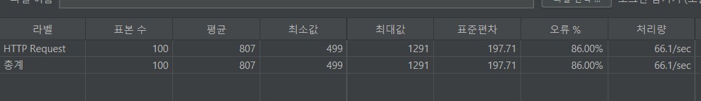
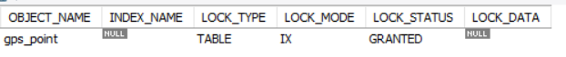
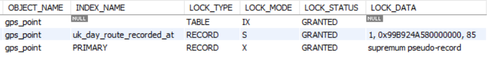
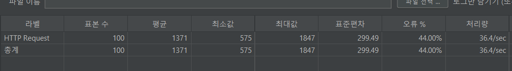
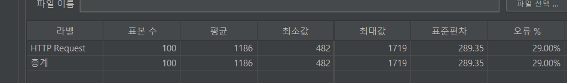

### 1. 문제 상황

- 좌표 일괄 업로드 api에서 재시도나 네트워크 중복 전송 같은 상황에서 같은 좌표가 중복으로 업로드될 때 DB 단에선 중복 좌표의 insert를 막아야한다.

- 따라서 gps_point에 (day_route_id, recorded_at)에 유니크 제약조건을 걸어놓았고 `INSERT IGNORE` 를 사용해서 중복 좌표 insert 시
  유니크 제약조건 위반 에러를 터뜨리지 않고 무시한 채로 중복되지 않는 좌표만 삽입되도록 하였다.

    ```java
      String sql = """
              INSERT IGNORE INTO gps_point(day_route_id, latitude, longitude, recorded_at)
              VALUES (?, ?, ?, ?)
          """;
    
      List<GpsPointRequest> points = request.gpsPoints();
    
      jdbcTemplate.batchUpdate(sql, points, points.size(), (ps, gpsPoint) -> {
          ps.setLong(1, dayRouteId);
          ps.setDouble(2, gpsPoint.latitude());
          ps.setDouble(3, gpsPoint.longitude());
          ps.setObject(4, gpsPoint.recordedAt());
      });
    ```

- 좌표 일괄 업로드 API에 대한 부하 테스트(사용자 100명이 1초 안에 API를 동시 호출) 중 중복되지 않는 좌표들의 업로드 요청은 모두 잘 처리되었지만 **중복 좌표에
  한에서는 오류율이 무려 86%임을 확인할 수 있었다.**



---

### 2. 배경 분석

**왜 에러가 발생하였을까?**

```
[Request processing failed: org.springframework.dao.CannotAcquireLockException: PreparedStateentCallback;
SQL [
INSERT IGNORE INTO gps_point(day_route_id, latitude, longitude, recorded_at)
    VALUES (?, ?, ?, ?)
];
Deadlock found when trying to get lock; try restarting transaction] with root cause
```

좌표 일괄 insert 과정에서 db는 데드락을 감지하였다. 그 결과 한 트랜잭션을 강제로 롤백시키고 애플리케이션 단에 예외를 발생시켰다.

**데드락이 탐지된 로그를 살펴보자**

```json
-----------------------
LATEST DETECTED DEADLOCK
------------------------
2026-02-24 15:37: 38 0x1ef8
*** (1) TRANSACTION: TRANSACTION 663620, ACTIVE 0 sec inserting
mysql tables in use 1, locked 1
LOCK WAIT 9 lock struct(s), heap size 1128, 5 row lock(s)
MySQL thread id 424, OS thread handle 2732, query id 34382061 localhost 127.0.0.1 root update
INSERT IGNORE INTO gps_point(day_route_id, latitude, longitude, recorded_at)
VALUES (2, 37.56655, 126.9782, '2026-02-18 09:01:00')

*** (1) HOLDS THE LOCK(S): RECORD LOCKS space id 18267 page no 4 n bits 160 index PRIMARY of table capstone.gps_point trx id 663620 lock_mode X
Record lock, heap no 1 PHYSICAL RECORD: n_fields 1; compact format; info bits 0
0: len 8; hex 73757072656d756d; asc supremum;;


*** (1) WAITING FOR THIS LOCK TO BE GRANTED: RECORD LOCKS space id 18267 page no 4 n bits 160 index PRIMARY of table capstone.gps_point trx id 663620 lock_mode X insert intention waiting
Record lock, heap no 1 PHYSICAL RECORD: n_fields 1; compact format; info bits 0
0: len 8; hex 73757072656d756d; asc supremum;;


*** (2) TRANSACTION: TRANSACTION 663622, ACTIVE 0 sec inserting
mysql tables in use 1, locked 1
LOCK WAIT 9 lock struct(s), heap size 1128, 5 row lock(s)
MySQL thread id 425, OS thread handle 14824, query id 34382066 localhost 127.0.0.1 root update
INSERT IGNORE INTO gps_point(day_route_id, latitude, longitude, recorded_at)
VALUES (2, 37.56655, 126.9782, '2026-02-18 09:01:00')

*** (2) HOLDS THE LOCK(S): RECORD LOCKS space id 18267 page no 4 n bits 160 index PRIMARY of table capstone.gps_point trx id 663622 lock_mode X
Record lock, heap no 1 PHYSICAL RECORD: n_fields 1; compact format; info bits 0
0: len 8; hex 73757072656d756d; asc supremum;;


*** (2) WAITING FOR THIS LOCK TO BE GRANTED: RECORD LOCKS space id 18267 page no 4 n bits 160 index PRIMARY of table capstone.gps_point trx id 663622 lock_mode X insert intention waiting
Record lock, heap no 1 PHYSICAL RECORD: n_fields 1; compact format; info bits 0
0: len 8; hex 73757072656d756d; asc supremum;;

*** WE ROLL BACK TRANSACTION (2)
```

트랜잭션 1과 2는 유니크 제약조건이 걸린 (day_route_id, recorded_at)이 동일한 row를 insert하려는 상황이다. 두 트랜잭션 모두 supremum (
인덱스 페이지 맨 끝을 나타내는 가상 레코드) 위치에 대해 insert intention lock을 요청했지만 서로가 가진 락 때문에 둘 다 다음 insert 단계로 못 넘어가서
데드락이 발생하여 트랜잭션 2를 롤백했다. 결론적으로 두 트랜잭션이 supremum 위치의 insert intention lock을 기다리다가 결국 데드락이 발생한 것으로 보인다.

**중복되지 않은 좌표를 INSERT IGNORE 해보자**



해당 테이블에 대한 IX 락만 걸린 것을 확인할 수 있었다.

**중복된 좌표를 INSERT IGNORE해보자**



이미 DB에 적재된 좌표 중 유니크 인덱스가 겹치는 좌표를 INSERT IGNORE해보고 해당 트랜잭션에 걸리는 락을 확인해보았다.

테이블에 IX 락이 걸리고 중복되지 않은 좌표를 INSERT IGNORE한 것과 다르게 유니크 인덱스에 대한 S락과 pk 인덱스에 supremum pseudo-record X락이
걸렸다. supremum pseudo-record는 인덱스의 맨 끝을 의미하는 가상 레코드로 현재 insert하려는 값이 인덱스의 마지막 위치에 들어갈 때 걸리는 락이다.

그런데 여기서 이상한 점은 테스트에 사용했던 중복 좌표의 pk는 1로 AUTO_INCREMENT로 총 80개의 gps_point를 적재했기 때문에 PK 인덱스의 가장 마지막 위치에
올 수 없었다.

왠지 모르겠지만 `INSERT IGNORE` 에서 중복 값을 삽입될 때 DB는 PK 인덱스에 supremum pseudo record 락을 건다는 건다.
AUTO_INCREMENT를 사용하는 경우 새로운 레코드는 항상 인덱스의 끝에 추가되기 때문에, 이 락으로 인해 모든 새로운 레코드 삽입이 차단되는 상황이 발생한다. 나는
삽입하고자 하는 유니크 인덱스에만 락을 걸 줄 알았는데 광범위적으로 새로운 레코드의 삽입도 막고 있었다.

계속해서 데드락이 supremum 위치에서 경합된 것을 보아 중복된 좌표 삽입 시 AUTO_INCREMENT를 사용하는 모든 삽입 시도를 차단하여 동시성이 크게 저하되어
트랜잭션들이 supremum 위치에 삽입할 수 있는 락을 얻지 못해 데드락이 발생한 것이 아닌가 싶었다.

**INSERT IGNORE의 동작 원리**

`INSERT IGNORE`가 어떻게 동작하길래 supremum pseudo record 락을 거는지 궁금했다. 중복 레코드가 존재하는 경우 모든 INSERT를 잠근다는 것이 너무
비효율적이라 생각했기 때문이다.

따라서[MySQL 의 공식 문서](https://dev.mysql.com/doc/refman/8.4/en/insert.html)확인했다.

> If you use the IGNORE modifier, ignorable errors that occur while executing the INSERT statement
> are ignored. For example, without IGNORE, a row that duplicates an existing UNIQUE index or PRIMARY
> KEY value in the table causes a duplicate-key error and the statement is aborted. With IGNORE, the
> row is discarded and no error occurs. Ignored errors generate warnings instead.

> Several statements in MySQL support an optional IGNORE keyword. This keyword causes the server to
> downgrade certain types of errors and generate warnings instead.

> INSERT: With IGNORE, rows that duplicate an existing row on a unique key value are discarded.

문서 내용에 따르면`**INSERT IGNORE**`**문은 레코드를 먼저 삽입하고 중복 에러가 발생하면 해당 행을 삭제하는 방식으로 동작한다**. 에러는 경고로 다운그레이드되며
이는 에러가 발생하지 않는 것이 아니라 에러를 핸들링 하는 것임을 의미한다.

실제로 중복된 값에 대해`INSERT IGNORE`를 실행하고 커밋한 후, 새로운 레코드를 삽입했을 때 id 가 하나 건너뛰어 저장되는 것을 확인할 수 있었다. (AUTO
INCREMENT인 경우)

**그렇다면 INSERT IGNORE 시 중복 에러가 발생하면 왜 supremum pseudo record 락을 거는 것일까?**

[공식 문서](https://dev.mysql.com/doc/refman/8.4/en/innodb-locking.html#innodb-next-key-locks)에 따르면
기본적으로 MySQL의 락 메커니즘은 다음과 같다.

> InnoDB performs row-level locking in such a way that when it searches or scans a table index, it
> sets shared or exclusive locks on the index records it encounters. Thus, the row-level locks are
> actually index-record locks. A next-key lock on an index record also affects the “gap” before that
> index record. That is, a next-key lock is an index-record lock plus a gap lock on the gap preceding
> the index record. If one session has a shared or exclusive lock on record R in an index, another
> session cannot insert a new index record in the gap immediately before R in the index order.

**MySQL은 REPEATABLE READ 수준에서 인덱스를 스캔한 범위만큼 락을 건다.** 따라서 이 메커니즘에 따르면, 삽입 후 삭제를 하면서 PK 인덱스의 끝인
supremum record를 스캔 범위로 보는 것이 아닐까 싶다.


---

### 4. 해결 방법

사실 동시에 중복 좌표 업로드가 발생할 확률은 매우 낮다. 따라서 데드락이 발생하여 실패한 요청에 대해서는 재시도하는 로직을 도입하기로 했다. 중복 좌표 업로드를 위해 트랜잭션의
격리성을 높인다던가 등의 동시성이 저하되는 방법을 도입하기엔 과하다고 생각했다.

좌표 일괄 업로드 서비스 코드에 `CannotAcquireLockException` (데드락 발생 시 터지는 예외)가 발생할 때 최대 3번의 재시도를 하도록 하였다.

```java
@Retryable(
    retryFor = {
        CannotAcquireLockException.class
    },
    maxAttempts = 3,
    backoff = @Backoff(delay = 100, multiplier = 2)
)
```

deplay 50ms, multiplier=2, maxAttempts=3



deplay 100ms, multiplier=2, maxAttempts=3



오류를 완전히 없앨 순 없었지만 재시도 로직을 도입함으로써 오류율이 86%에서 29%로 감소했다.

---

### 5. 배운 점

INSERT IGNORE는 생각보다 동시성이 떨어지는 방법이었다. 일단 삽입해보고 중복 에러가 발생하면 다시 스캔하여 삭제하는 방식이기 때문이다. 이 과정에서 모든 레코드의 새로운
삽입을 막는 supremum pseudo record이 걸리고 여기서 걸리는 락이 supremum 위치에서의 교착 상태를 만드는 원인이었다. DB가 어떤 매커니즘으로 락을 거는 지
솔직히 아직도 완전히 이해하지 못했다. 이런식으로 동작하지 않을까… 싶은 나의 논리적 추론에 가깝다. 어쨌든 중복 데이터 삽입 시 데드락이 발생한다는 것을 확인하였고 이를 개선하는
재시도 로직을 넣어본 것에 의의를 둬야할까…
