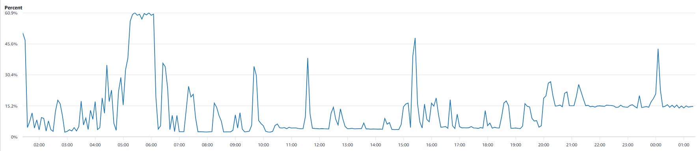
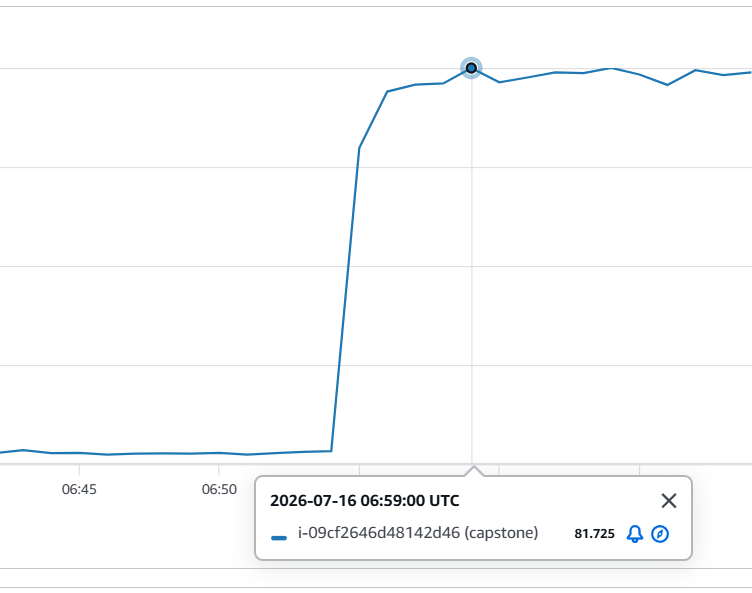

# EC2 응답 불능 문제 분석 — 리클레임 스래싱

**2026-07-15 00:46 UTC부터 2026-07-16 04:00 UTC(재부팅)까지, EC2가 약 27시간 동안
응답불능 상태에서 스스로 회복하지 못했다.** 커널이 CPU를 계속 태우면서 아무 일도
진척시키지 못하는 **livelock**에 빠져 있었다.

응답불능 기간 대부분(27시간 중 앞부분)은 SSH·SSM이 모두 불가능했으므로, 그 구간의
분석은 **하이퍼바이저가 게스트 OS와 무관하게 측정하는 지표(`AWS/EC2` 네임스페이스)**와
**게스트 내 에이전트가 죽기 직전까지 남긴 마지막 기록(`Gilbut/EC2` 네임스페이스)**만으로
원인을 역추적한 결과다. 이후 인스턴스를 재부팅해 접속을 복구하고, 로컬 원본
(`kern.log`, `docker inspect`)으로 핵심 가설들을 검증했다.

## 리클레임 스래싱(Reclaim Thrashing)이란

**"스래싱"의 원래 정의부터 보면 이해가 쉽다.** 전통적인 스래싱(swap thrashing)은 **시스템이
실제 일(useful work)보다 메모리를 확보하는 데 더 많은 시간을 쓰는 상태**를 가리킨다.
원래는 "RAM ↔ swap 디스크 사이에서 페이지를 계속 왔다 갔다 옮기느라 CPU가 다 소진되는"
상황을 뜻했다. **리클레임 스래싱은 이 개념을 swap이 없는 상황으로 일반화한 것**이다 —
대상이 "swap 페이지"에서 "회수 가능한 페이지(주로 파일 캐시)"로 바뀔 뿐, 구조는 같다.

### 핵심 순환 구조

`★ 스래싱이 되는 이유 ─────────────────────────────`

```
1. 메모리가 부족해 새 할당 요청이 들어옴
2. 커널이 회수 가능한 페이지를 찾으려 LRU 리스트를 스캔
3. 찾은 페이지를 내쫓음(evict) — 예: 자주 안 쓸 것 같은 파일 캐시 페이지
4. 그런데 그 페이지가 사실 "곧 다시 필요한 것"이었음
5. 다시 필요해지는 순간 페이지 폴트 → 디스크에서 재요청(refault)
6. 재요청도 메모리가 필요하니 → 다시 1번으로
```

이 루프가 도는 근본 이유는 **"작업집합(working set)이 실제로 확보 가능한 여유 메모리보다
크다"**는 것이다. 커널은 LRU 알고리즘으로 나름 합리적으로 페이지를 내쫓지만, 여유가 너무
없으면 **"안 쓸 것 같아서 내쫓은 페이지"가 사실 "곧 또 쓸 페이지"인 경우가 계속
반복**된다.

`─────────────────────────────────────────────────`

### 데드락이 아니라 라이브락인 이유

가장 반직관적인 특징은 **아무것도 멈춰 있지 않다**는 것이다.

- 데드락: 모든 게 그냥 멈춰서 CPU도 안 씀
- 리클레임 스래싱(라이브락): **CPU는 계속 바쁘게 돌아간다** — 스캔하고, 내쫓고,
  재요청하고, 다시 스캔하고... 그런데 **시스템 전체로 보면 아무 진전이 없다.** 밖에서
  보면 "열심히 일하는 것 같은데 결과물이 하나도 안 나오는" 상태다.

### swap 유무가 왜 결정적인가

회수 가능한 페이지는 두 종류다.

| 종류                          | swap 없을 때                      |
|-----------------------------|--------------------------------|
| 파일 백업 페이지(실행 코드, 라이브러리, 캐시) | 회수 가능 — 디스크에 원본이 있음            |
| 익명 페이지(힙, 스택)               | 회수 절대 불가 — swap이 있어야만 내보낼 수 있음 |

swap이 없으면 회수 가능한 풀(pool) 자체가 절반으로 줄어든다. JVM 힙처럼 메모리를 가장
많이 차지하는 부분이 통째로 "손댈 수 없는 영역"이 되고, 커널은 상대적으로 작은 파일
캐시만 가지고 계속 돌려막기를 해야 하니 스래싱에 훨씬 쉽게 빠진다.

### OOM-kill과의 관계 — 왜 둘 다 안 일어나기도 하는가

리클레임 스래싱과 OOM-kill은 **같은 메모리 부족 상황에 대한 서로 다른 결말**이다.

- 회수 시도가 완전히 실패(0 페이지)하면 → 커널이 포기하고 OOM-killer 호출 → 프로세스
  하나 죽고 **깨끗하게 종료**
- 회수 시도가 "약간은" 성공(몇 MiB씩)하면 → 커널이 "조금만 더 하면 된다"고 판단해
  재시도 → **아무도 안 죽고 영원히 스캔만 반복**

즉 리클레임 스래싱은 **"완전히 실패하지도, 완전히 성공하지도 않는 애매한 지점"**에서
생기는, 어떤 의미로는 더 나쁜 상태다 — 최소한 OOM-kill은 시스템을 정상으로 되돌리기라도
하기 때문이다.

## 결론 요약

| 항목                | 내용                                                                                                   |
|-------------------|------------------------------------------------------------------------------------------------------|
| 현상                | SSH·SSM·CloudWatch Agent 전부 무응답, 인스턴스 상태검사 `impaired`                                                |
| 지속 시간             | **약 27시간** (2026-07-15 00:46 → 07-16 04:00 재부팅으로 종료)                                                 |
| 직접 원인             | **가용 메모리가 0~11 MiB 사이를 진동**하며 커널이 페이지 회수(reclaim)를 무한 반복                                             |
| OOM-killer 미발동 이유 | 회수가 **"0은 아닌"** 진척을 계속 내서, 커널이 `out_of_memory()`를 호출할 조건에 도달하지 못함                                    |
| 구조적 원인            | **swap 부재** — 익명 페이지(JVM 힙)가 회수 대상에서 원천 배제되어 커널이 건드릴 수 있는 게 파일 캐시뿐                                   |
| 인스턴스 생존 여부        | **죽지 않았음** — 하이퍼바이저 측정 CPU가 27시간 내내 계속 관측됨                                                           |
| 컨테이너 재시작 여부       | **없음(재부팅 전까지 확인)** — `myapp`/`redis` 모두 `RestartCount=0`, `OOMKilled=false`. 27시간 동안 단 한 번도 재시작되지 않음 |
| 진행 방향(재부팅 전까지)    | **악화 중이었음** — 07-15 20:00부터 회수가 멈추지 못하고(CPU 바닥 고착), 회수 효율이 약 1/3로 붕괴                                 |

## 타임라인 (전부 UTC)

| 시각                        | 사건                                                                               | 근거 지표                                     |
|---------------------------|----------------------------------------------------------------------------------|-------------------------------------------|
| 07-14 08:00~21:00         | 사건 이전 idle 기준선                                                                   | CPU 3.0~5.1%(평균 3.7%), EBSReadOps 약 38만/h |
| 07-14 23:00~07-15 00:00   | **전조** — EBS 읽기가 기준선의 4.7~6.5배로 치솟음                                              | EBSReadOps 247만/h → 177만/h                |
| 07-15 00:42~00:49         | 가용 메모리가 이미 **13.8~20.3 MiB**까지 말라 있음                                             | `mem_available`                           |
| **07-15 00:46:59**        | **SSM 에이전트 연결 두절**(`ConnectionLost`)                                             | SSM `LastPingDateTime`                    |
| 07-15 00:52               | 가용 메모리 **1.22 MiB**                                                              | `mem_available`                           |
| **07-15 00:57**           | 가용 메모리 **0.00 MiB** — 완전 고갈                                                      | `mem_available`                           |
| 07-15 01:00~01:30         | CPU 28.3% → **51.0%** 상승, EBS 읽기 **362만/h(≈1,006 IOPS)** 정점                      | CPU / EBSReadOps                          |
| **07-15 01:20**           | **CloudWatch Agent 최종 보고 후 영구 중단** (마지막 값: `mem_available` 4.57 MiB)             | `Gilbut/EC2` 지표 소실                        |
| 07-15 02:00               | 네트워크 트래픽 사실상 소멸 (724 KB/h → 30 KB/h)                                             | NetworkIn                                 |
| **07-15 02:48**           | **인스턴스 상태검사 실패**(`reachability: failed`) — 커널 네트워크 스택까지 응답 정지                    | `StatusCheckFailed_Instance`              |
| 07-15 05:15~06:05         | 최대 규모 스파이크 — CPU **60.9%가 50분간 지속**, EBS 읽기 **681만/h(≈1,892 IOPS)**              | CPU / EBSReadOps                          |
| 07-15 02:48 ~ 19:59       | **Phase A** — 회수 폭풍과 정적이 번갈아 반복. CPU 바닥은 2.1~4.0%로 기준선까지 회복하지만 **인스턴스는 계속 응답불능** | CPU(시간별 Minimum)                          |
| **07-15 20:00**           | **Phase B 전환** — CPU 바닥이 11.7%로 올라붙고 **이후 단 한 번도 내려오지 않음**                       | CPU(시간별 Minimum)                          |
| 07-15 20:00 ~ 07-16 04:00 | 바닥 12~14% 고착 + 불규칙 스파이크 지속. EBS 읽기는 **Phase A와 완전히 동일한 144 IOPS 유지**             | CPU / EBSReadOps                          |
| **07-16 04:00**           | **수동 재부팅**(`aws ec2 reboot-instances`) — 04:05경 SSH·SSM 복구, livelock 종료          | 재부팅 명령 로그                                 |

## 증거 1 — 가용 메모리가 0을 찍고도 OOM-killer가 발동하지 않았다

CloudWatch Agent가 죽기 직전까지 남긴 `mem_available` 마지막 20개 기록이다. **이 데이터가 이번 사건의 핵심이다.**

```
00:42  13.76 MiB     00:57   0.00 MiB  ← 완전 고갈
00:43  17.57 MiB     01:04   6.02 MiB  ← 다시 회복
00:44  16.88 MiB     01:06   5.33 MiB
00:45  20.25 MiB     01:10   7.08 MiB
00:46  17.29 MiB     01:11   3.56 MiB
00:47  14.94 MiB     01:13   5.47 MiB
00:48  19.50 MiB     01:14  11.25 MiB  ← 이 구간 최대
00:49  18.28 MiB     01:15  10.00 MiB
00:52   1.22 MiB     01:16   8.40 MiB
00:56   6.89 MiB     01:20   4.57 MiB  ← 마지막 기록, 이후 영구 침묵
```

`★ 이 진동이 왜 결정적인가 ─────────────────────────────────`

리눅스 커널은 메모리 할당(`__alloc_pages_slowpath`)에 실패해도 곧바로 OOM-killer를
부르지 않는다. **먼저 회수를 시도하고, `should_reclaim_retry()`로 "다시 시도할 가치가
있는가"를 판정**한다. 회수가 **단 몇 페이지라도 진척을 냈다면** 커널은 "조금만 더 하면
되겠다"고 판단해 `out_of_memory()` 대신 **재시도 루프로 돌아간다.**

위 데이터는 회수가 **매번 3~11 MiB씩 진척을 내고 있었다**는 걸 보여준다. 커널 입장에선
"회수가 잘 되고 있는" 상태다. 그런데 그렇게 확보한 몇 MiB가 **다음 순간 즉시 다시
소모되어** 원점으로 돌아온다.

- 회수 진척 = 0 이었다면 → 커널이 포기하고 OOM-killer 발동 → 프로세스 하나 죽고 **상황 종료**
- 회수 진척 = 넉넉했다면 → 정상 복구
- **회수 진척 = "0은 아닌데 무의미한 수준"** → 커널은 영원히 재시도하고, 아무도 죽지 않고,
  아무것도 나아지지 않는다 ← **지금 이 상태**

이것이 **livelock**의 정확한 정의다. 데드락(아무것도 안 움직임)이 아니라, **모두가 열심히
움직이는데 전체적으로는 아무 진척이 없는** 상태다. 역설적이게도 **OOM-killer가 발동하는
편이 훨씬 나았을 상황**이다 — 프로세스 하나를 잃는 대신 시스템은 즉시 정상으로 돌아왔을
것이다.

`─────────────────────────────────────────────────`

## 증거 2 — CPU는 4배인데 디스크 읽기는 1.36배뿐

사건 이전 기준선과 현재를 비교하면 **두 지표가 전혀 다른 배율로 움직였다.**

| 지표             | 사건 이전 idle 기준선          | 현재(고착 상태)                 | 배율                |
|----------------|-------------------------|---------------------------|-------------------|
| CPUUtilization | 평균 **3.7%**             | **14~16%**                | **≈4.05배**        |
| EBSReadOps     | 약 **38만/h** (≈106 IOPS) | 약 **51.5만/h** (≈143 IOPS) | **≈1.36배**        |
| EBSWriteOps    | 약 2,900/h (≈0.8 IOPS)   | 약 2,930/h (≈0.8 IOPS)     | **≈1.0배 (변화 없음)** |

`★ 이 불균형이 말해주는 것 ───────────────────────────`

만약 이게 단순한 **리페이지 폴트 스래싱**(페이지를 내쫓았다가 곧바로 디스크에서 다시
읽어오는 것)이었다면, CPU와 디스크(EBS) 읽기가 **비슷한 배율로 함께** 올랐어야 한다. 실제로는
CPU만 4배가 되고 디스크 읽기는 1.36배에 그쳤다.

**즉 CPU는 디스크를 기다리느라 쓰인 게 아니라, 순수하게 "스캔"에 쓰이고 있다.**
커널이 LRU 리스트를 계속 걸어 다니며 "내쫓을 만한 페이지가 있나" 찾는데, **거의 다 내쫓을
수 없는 페이지라 헛걸음만 반복**하는 것이다. 커널 용어로는 `pgscan`(스캔한 페이지 수)은
폭증하는데 `pgsteal`(실제로 회수한 페이지 수)은 미미한 상태다.

> 참고: CloudWatch의 `CPUUtilization`은 I/O 대기(iowait)를 CPU 사용으로 계산하지 않는다.
> 따라서 14~16%는 **디스크를 기다린 시간이 아니라 실제로 태운 CPU**다.

쓰기(`EBSWriteOps`)가 기준선과 **완전히 동일**하다는 점도 같은 결론을 뒷받침한다 — 새로
저장되는 데이터는 없고 **오직 읽기만** 늘었다. 애플리케이션이 일을 하고 있는 게 아니라,
커널이 헛돌고 있는 것이다.

`─────────────────────────────────────────────────`

## 증거 3 — 지표의 "결측" 자체가 증상이다

CloudWatch Agent는 60초 주기로 지표를 수집하도록 설정돼 있다(`monitoring.tf`의
`metrics_collection_interval = 60`). 그런데 마지막 기록들의 타임스탬프를 보면 **주기가
깨져 있다.**

```
00:42 00:43 00:44 00:45 00:46 00:47 00:48 00:49   ← 여기까지 1분 간격 정상
                                        │
                                        ├─ 3분 결측 ─┤
00:52 ──── 4분 결측 ──── 00:56  00:57
                                 │
                                 ├──── 7분 결측 ────┤   ← 가장 긴 공백
                                                  01:04 ─ 4분 결측 ─ 01:06
01:10  01:11 ─ 2분 결측 ─ 01:13  01:14  01:15  01:16
                                                  │
                                                  ├─ 4분 결측 ─┤
                                                            01:20  ← 마지막
```

**에이전트가 자기 수집 주기를 완주하지 못하고 있었다.** `/proc/meminfo`를 읽고 값을
포장해 전송하는 이 가벼운 작업조차, 메모리 할당이 필요한 순간마다 회수 경쟁에 걸려
수 분씩 멈춰 세워진 것이다. **가용 메모리가 0을 찍은 00:57 직후에 가장 긴 7분 공백이
나타난 것**은 우연이 아니다.

즉 이 결측 구간들은 단순한 "데이터 유실"이 아니라 **관측자 자신이 피해자가 되어가는
과정의 기록**이다.

## 증거 4 — 죽은 순서가 원인을 지목한다

세 관측 채널이 **정확히 이 순서로** 죽었다.

| 순서 | 시각        | 대상                                | 동작 계층  |
|----|-----------|-----------------------------------|--------|
| 1  | 00:46:59  | SSM 에이전트                          | 유저스페이스 |
| 2  | 01:20     | CloudWatch Agent                  | 유저스페이스 |
| 3  | **02:48** | **커널 네트워크 스택**(상태검사 reachability) | **커널** |

`★ 왜 유저스페이스가 먼저, 커널이 1시간 28분 뒤에 죽었나 ──────`

- **유저스페이스 프로세스**는 무슨 일을 하든 메모리 할당(`GFP_KERNEL`)이 필요하고, 이
  할당은 **회수를 기다리며 잠들 수 있는(blocking) 경로**다. 그래서 회수 루프에 걸리는 즉시
  멈춘다. SSM 에이전트와 CloudWatch Agent가 먼저 죽은 이유다.
- **커널의 네트워크 응답 경로**(ARP/ICMP 처리)는 softirq 컨텍스트에서 `GFP_ATOMIC`으로
  할당한다. 이건 **잠들 수 없는 대신 긴급 예비 메모리(emergency reserve)에 접근**할 수
  있다. 그래서 유저스페이스가 전멸한 뒤에도 **예비 메모리가 버텨준 1시간 28분 동안은
  하이퍼바이저의 도달성 검사에 계속 응답**할 수 있었다.
- 02:48에 그 예비 메모리마저 바닥나면서 `sk_buff` 할당이 실패하기 시작했고, 그 순간
  **인스턴스 상태검사가 실패로 뒤집혔다.**

네트워크 트래픽(`NetworkIn`)이 이 순서를 그대로 뒷받침한다.

```
07-15 00:00   724 KB/h   ← 두 에이전트가 AWS 엔드포인트와 정상 통신
07-15 01:00   202 KB/h   ← 에이전트들이 죽어가는 중
07-15 02:00    30 KB/h
07-15 03:00   6.5 KB/h
07-15 04:00~  1~6 KB/h   ← 사실상 소멸 (잔여 ARP 노이즈 수준)
```

원래의 700 KB/h는 두 에이전트가 만들어내던 트래픽이었고, 그들이 죽자 네트워크도 함께
침묵했다.

`─────────────────────────────────────────────────`

## 증거 5 — CPU 진동 패턴



응답불능 이후 CPU 그래프는 **끊임없이 오르락내리락하는 톱니 모양**을 그린다.

| 시각(UTC)         | 최소        | 평균    | 최대    | 국면                  |
|-----------------|-----------|-------|-------|---------------------|
| 07-14 20:00     | 3.0%      | 3.7%  | 4.6%  | 사건 이전 정상            |
| 07-14 21:00     | 3.1%      | 3.7%  | 4.6%  | 사건 이전 정상            |
| 07-14 23:00     | 4.7%      | 14.6% | 61.8% | 전조 시작               |
| 07-15 01:00     | **2.3%**  | 25.7% | 72.2% | **Phase A**         |
| 07-15 05:00     | **4.0%**  | 51.9% | 62.0% | Phase A (최대 폭풍)     |
| 07-15 10:00     | **2.2%**  | 4.0%  | 14.1% | Phase A (거의 완전한 정적) |
| 07-15 13:00     | **3.5%**  | 4.1%  | 13.2% | Phase A             |
| 07-15 19:00     | **3.3%**  | 8.2%  | 22.5% | Phase A 마지막         |
| **07-15 20:00** | **11.7%** | 19.3% | 33.3% | **← Phase B 전환**    |
| 07-15 22:00     | **13.6%** | 15.0% | 16.4% | Phase B             |
| 07-16 00:00     | **12.7%** | 18.4% | 50.6% | Phase B (현재)        |

### 봉우리와 골짜기는 각각 무엇인가

`★ 진동의 정체 ─────────────────────────────────────`

- **봉우리(스파이크)** = 시스템이 회복을 시도하는 게 아니다. **누군가가 메모리를 요청한
  순간 촉발된 회수 폭풍**이다. 메모리가 꽉 찬 상태에서 어떤 프로세스든 할당을 시도하면
  `__alloc_pages_slowpath` → 직접 회수(direct reclaim)로 끌려들어가고, 요청자 자신이
  스캔을 수행하며 CPU를 태운다. 요청자가 결국 블록되거나 포기하면 스파이크가 끝난다.
- **골짜기** = 시스템이 회복된 게 아니다. **아무도 메모리를 요청하지 않아서 조용한
  것**이다. 메모리는 여전히 꽉 차 있다. 요청이 없으니 회수도 없고, 그래서 CPU가 낮다.

즉 **CPU가 낮다는 건 "건강하다"가 아니라 "아무도 살아서 뭘 하려 하지 않는다"는 뜻**이다.

`─────────────────────────────────────────────────`

### 결정적 사실 — 골짜기에서도 인스턴스는 계속 응답불능이었다

07-15 10:00은 CPU 평균 **4.0%**, 최소 **2.2%**로 **사건 이전 정상 기준선(3.7%)과 사실상
같다.** 지표만 보면 완전히 평온한 서버다.

**그런데 그 시각에도 인스턴스는 `impaired` 상태였다**(02:48부터 지금까지 단 한 순간도
회복된 적 없음). SSH·SSM·CloudWatch Agent 모두 죽은 채였다.

> **CPU가 기준선으로 돌아오는 것과 시스템이 회복되는 것은 아무 상관이 없다.**
> 죽은 프로세스는 CPU를 쓰지 않는다. 조용한 것은 회복의 신호가 아니라 사망의 신호였다.

Phase A의 최소값(2.1~2.5%)이 **사건 이전 기준선(3.0~3.1%)보다 오히려 낮다**는 점도 같은
이야기를 한다 — 원래 그 3%를 만들던 에이전트·스케줄러들이 전부 죽어서, 시스템이 **정상일
때보다 더 조용해진** 것이다.

### Phase B — 07-15 20:00, 바닥이 올라붙고 다시는 내려오지 않았다

이 사건의 성격이 바뀐 시점이 지표에 뚜렷하게 찍혀 있다.

|                | Phase A (00:46~19:59)   | Phase B (20:00~현재)               |
|----------------|-------------------------|----------------------------------|
| CPU 바닥(시간별 최소) | **2.1~4.0%** (기준선까지 회복) | **11.7~13.6%** (한 번도 안 내려옴)      |
| 해석             | 폭풍과 정적이 번갈아 나타남         | **정적이 사라짐 — 회수가 24시간 내내 멈추지 않음** |

Phase A에서는 회수 폭풍이 지나가면 커널이 잠잠해질 수 있었다. Phase B에서는 **더 이상
잠잠해지지 못한다.** 리눅스의 `kswapd`(백그라운드 회수 커널 스레드)는 가용 메모리가
`high watermark`를 넘어서면 잠드는데, **이제는 그 수위에 영영 도달하지 못해 계속 깨어
있는 상태**로 보는 것이 이 패턴에 가장 부합한다.

### Phase B의 추가 CPU는 디스크를 전혀 건드리지 않았다

Phase A의 조용한 시간과 Phase B의 바닥 구간에서 EBS 읽기를 5분 단위로 비교하면 —
**완전히 똑같다.**

```
07-15 13:00대 (Phase A, CPU 평균 4.1%)     07-15 22:00대 (Phase B, CPU 최소 13.6%)
  13:00   42,805회/5분  ≈143 IOPS            22:00   43,954회/5분  ≈147 IOPS
  13:15   43,509회/5분  ≈145 IOPS            22:15   43,398회/5분  ≈145 IOPS
  13:30   42,900회/5분  ≈143 IOPS            22:30   42,952회/5분  ≈143 IOPS
  13:45   43,212회/5분  ≈144 IOPS            22:45   43,913회/5분  ≈146 IOPS
  13:55   42,583회/5분  ≈142 IOPS            22:55   44,033회/5분  ≈147 IOPS
```

`★ 이 대조가 확정하는 것 ───────────────────────────`

CPU는 4.1% → 13.6%로 **3.3배**가 됐는데, EBS 읽기는 **143 IOPS → 144 IOPS로 완전히
동일하다.** 두 지표가 **완벽하게 분리**됐다.

→ **Phase B에서 늘어난 CPU는 단 1바이트의 디스크 읽기도 유발하지 않았다.**
페이지를 실제로 회수해서 다시 읽어오는 일(refault)은 전혀 늘지 않았고, **오직 "회수할
페이지를 찾아 헤매는 스캔"만 3.3배로 늘었다.**

이것은 **회수 효율(`pgsteal`/`pgscan`)이 약 1/3로 붕괴했다**는 뜻이다. 같은 성과(144
IOPS만큼의 회수)를 내기 위해 커널이 3.3배 더 많이 스캔해야 하는 상태가 된 것이다.

**이 사건은 안정된 게 아니라 계속 악화되고 있다.** 18시간에 걸쳐 회수 가능한 페이지가
서서히 고갈되면서, 20:00 무렵 "스캔해도 거의 아무것도 안 나오는" 임계를 넘었다.

`─────────────────────────────────────────────────`

### 144 IOPS라는 숫자가 스스로 말하는 것

EBS 읽기가 24시간 내내 **143~147 IOPS에서 편차 ±2% 이내로 못 박혀 있다**는 점도 그냥
지나칠 수 없다. 부하가 오르내리고 CPU가 3배씩 요동치는데도 이 값만은 요지부동이다.

`1초 ÷ 144회 ≈ 6.9ms`. 이 수치는 **gp3 EBS의 전형적인 랜덤 읽기 지연(약 1~10ms)과 정확히
일치한다.** 즉 이 144 IOPS는 **수요가 결정한 값이 아니라 EBS 지연이 결정한 값**이다 —
페이지 폴트가 한 번에 하나씩 직렬로 처리되고, 각각이 EBS 응답을 기다리느라 6.9ms씩
소모되는 루프가 **24시간째 쉬지 않고 돌고 있다**는 뜻이다.

이 속도로 하루 동안 읽어들인 양은 대략 **144 × 4KB × 86,400초 ≈ 48GB**다. 아무 일도 하지
않는 서버가 자기 코드를 다시 읽어오기 위해서만 하루에 48GB를 읽었다.

## 근본 원인 — swap 부재가 커널의 선택지를 절반으로 잘라냈다

현재 서버는 swap이 완전히 제거된 상태이다.

리눅스가 메모리를 회수할 수 있는 페이지는 크게 두 종류다.

| 종류                     | 내용                              | swap 없을 때                              |
|------------------------|---------------------------------|----------------------------------------|
| **파일 백업(file-backed)** | 실행 파일 코드, 라이브러리, 페이지 캐시         | **회수 가능** — 디스크에 원본이 있으니 버렸다가 다시 읽으면 됨 |
| **익명(anonymous)**      | **JVM 힙**, 스택 등 디스크에 원본이 없는 메모리 | **회수 절대 불가** — 내보낼 곳(swap)이 없음         |

`★ 여기서 모든 게 갈린다 ─────────────────────────────`

이 서버에서 메모리를 가장 많이 쓰는 건 JVM 힙이고, 그건 **전부 익명 페이지**다. swap이
없으므로 커널은 **이 거대한 덩어리를 단 1바이트도 건드릴 수 없다.** 커널에게 남은
선택지는 **파일 캐시뿐**이다.

그런데 파일 캐시를 내쫓으면 → 그 페이지는 **실행 중인 프로그램의 코드**였다 → 다음
순간 그 코드를 실행하려는 순간 **페이지 폴트가 나서 EBS에서 다시 읽어온다** → 읽어오려면
메모리가 필요하다 → **다시 회수한다.**

**회수 대상이 "지금 당장 다시 필요한 것"밖에 없는 상태.** 이게 스래싱이고, swap 부재가
이 상황을 구조적으로 강제했다. 익명 페이지가 회수 대상에서 빠지는 순간, 커널은 자기가
방금 내보낸 걸 즉시 다시 불러와야 하는 무한 루프에 갇힌다.

`─────────────────────────────────────────────────`

이 메커니즘은 앞선 증거들과 정확히 맞물린다.

- **증거 2의 불균형** → 파일 캐시는 이미 거의 다 내쫓겨 남은 게 없다. 그래서 스캔해도
  나오는 게 없어 CPU만 타고(4배), 실제로 회수돼 다시 읽히는 양은 적다(1.36배).
- **증거 1의 진동** → 그나마 몇 MiB씩은 회수되니 `should_reclaim_retry()`가 계속 재시도를
  택하고, OOM-killer는 영원히 호출되지 않는다.

## 이 EC2에서 일어난 리클레임 스래싱 시나리오

앞서 설명한 개념을 이 사건의 실제 타임라인에 그대로 대입하면 다음과 같은 이야기가 된다.

**전제 조건**: 무방어 이미지(`-Xmx`/`MaxRAMPercentage`/`mem_limit` 전부 없음)가 swap이
완전히 제거된 t3.micro(913MB)에 떠 있었다. JVM 힙(익명 페이지)이 메모리 대부분을
차지하고, 커널이 손댈 수 있는 건 나머지 얼마 안 되는 파일 캐시뿐이었다.

1. **여유가 서서히 바닥까지 깎임** — 07-14 23:00부터 EBS 읽기가 기준선의 4.7~6.5배로
   치솟기 시작했다(전조). 07-15 00:42 시점엔 가용 메모리가 이미 13.8~20.3 MiB까지
   말라 있었다.
2. **완전 고갈, 그러나 죽지 않음** — 00:57 가용 메모리가 0.00 MiB를 찍었다. 정상이라면
   여기서 OOM-killer가 호출돼야 하지만, 회수가 "0은 아닌"(3~11 MiB씩) 진척을 계속
   내면서 커널이 재시도 루프에 갇혔다(증거 1). 이게 스래싱의 시작이다.
3. **유저스페이스부터 순차적으로 전멸** — 스래싱 루프에 걸린 프로세스는 그대로
   멈춘다. `GFP_KERNEL`로 할당하는 일반 프로세스가 먼저 걸려 rsyslog(23:41:51) →
   SSM(00:46:59) → CloudWatch Agent(01:20) 순으로 응답을 멈췄다. 커널 네트워크
   스택만 `GFP_ATOMIC` 긴급 예비 메모리로 더 버티다 02:48에 함께 무너졌다(증거 4).
4. **국면이 두 번 바뀜** — Phase A(02:48~19:59)는 회수 폭풍과 정적이 번갈아 나타나는
   "간헐적" 스래싱이었다. 20:00부터는 CPU 바닥이 더 이상 기준선으로 안 내려오는
   Phase B로 전환됐다 — 회수 효율이 1/3로 붕괴하며 스래싱이 "고착"됐다(증거 5).
5. **자연 회복 없이 강제 종료** — 이 루프는 27시간 동안 스스로 못 빠져나왔고,
   2026-07-16 04:00 UTC 수동 재부팅으로 강제 종료됐다.

`★ 어디까지가 실측이고 어디부터가 추론인가 ─────────────`

이 시나리오에서 **직접 증명된 사실**은: 가용 메모리가 0~11 MiB를 오간 것(`mem_available`
실측), OOM-killer가 27시간 내내 한 번도 안 불린 것(`kern.log` 원문 대조), 유저스페이스
데몬들이 비슷한 시기에 순차적으로 응답을 멈춘 것(각 에이전트 로그 타임스탬프), 컨테이너가
단 한 번도 재시작 안 된 것(`docker inspect`)이다.

반면 **"그 CPU가 정확히 페이지 회수 스캔 때문"이라는 메커니즘 자체는 간접 추론이다.**
`/proc/vmstat`의 `pgscan`/`pgsteal` 카운터나 `perf` 프로파일처럼 그 순간 CPU가 커널의
어느 함수에서 소모됐는지 직접 보여주는 증거는 확보하지 못했다 — journald가 tmpfs에만
있다가 재부팅으로 소실됐고, 사건 당시 `perf`/`vmstat`을 실시간으로 띄워두지도 않았다.
CPU 급증·디스크 I/O 정체·OOM 미발동이라는 관측 결과는 리클레임 스래싱 가설과 가장 잘
들어맞지만, 락 경합(lock contention) 같은 다른 커널 레벨 라이브락도 이론적으로 같은
겉모습을 남길 수 있다는 점은 열어둬야 한다. 재발 시 `/proc/pressure/memory`(PSI)와
`/proc/vmstat`을 상주 프로세스로 로깅해두면 이 메커니즘을 직접 확정할 수 있다.

`─────────────────────────────────────────────────`

## 재부팅 직전 상태 (2026-07-16 04:00 UTC, 종료 시점)

| 항목               | 값                                              | 해석                             |
|------------------|------------------------------------------------|--------------------------------|
| 시스템 상태검사         | `ok`                                           | 하이퍼바이저·하드웨어는 정상                |
| 인스턴스 상태검사        | **`impaired`** (`ImpairedSince: 07-15 02:48`)  | 재부팅 순간까지 26시간 동안 단 한 번도 회복 안 됨 |
| CPUUtilization   | **바닥 12~14% 고착** (27h 평균 13% 내외, 최대 60.9%)     | 회수가 재부팅 순간까지 한 번도 멈추지 않음       |
| EBSReadOps       | 약 51만/h (144 IOPS, 전 구간 ±2% 이내)                | 스래싱이 재부팅 순간까지 지속               |
| NetworkIn        | 1~6 KB/h                                       | 유저스페이스 전멸 상태 유지                |
| `Gilbut/EC2` 지표  | **전무** (01:20 이후)                              | CloudWatch Agent 사망            |
| CPUCreditBalance | 하락 후 등락(07-15 06:00 43.9 → 18:00 73.5 → 하락 재개) | 크레딧 고갈로 인한 강제 스로틀은 관측되지 않음     |

CPU 스파이크는 **주기적이지 않고 불규칙**하다(00:50~01:30, 04:25~06:30, 09:40, 11:35,
15:20, 20:10, 21:15, 00:05). 고정된 주기가 없다는 건 크론·타이머 같은 정기 작업이 원인이
아니라, **어떤 프로세스든 스케줄을 얻어 메모리를 건드리는 순간 회수 폭풍이 촉발되는**
확률적 패턴에 가깝다는 뜻이다(증거 5). 외부 요청이 전혀 없는 idle 조건이므로, 이
스파이크는 내부 프로세스(스케줄러 깨어남, GC, kswapd)에 의한 것으로 추정된다.

## 재부팅 후 확인 결과 (접속 복구 완료, 2026-07-16 04:05 UTC)

당초 "접속 복구 시 최우선 확인 항목"으로 남겨뒀던 5가지 중 4가지를 확인했다.

1. **`journalctl -k` (사건 당시 저널) — 확인 불가로 확정.** 재부팅 전까지 SSH·SSM이
   끝까지 복구되지 않아, tmpfs에만 있던 저널을 꺼낼 기회 자체가 없었다. 재부팅과 동시에
   영구 소실됐다 — 이 항목은 "깜빡해서 놓친 것"이 아니라 애초에 **접근 수단이 없어
   실행 불가능했다.**

2. **컨테이너 재시작 여부 — `RestartCount=0`, `OOMKilled=false`로 확정.**
   ```
   myapp: RestartCount=0  OOMKilled=false  Status=running
   redis: RestartCount=0  OOMKilled=false  Status=running
   ```
   `myapp`은 최초 배포(07-14 07:50경) 이후 **재부팅 전까지 단 한 번도 재시작되지
   않았다.** 05:15~06:05의 대형 스파이크(CPU 60.9%, EBS 1,892 IOPS)도 JVM 콜드 스타트가
   아니라는 뜻 — 순수하게 커널 회수 스캔만으로 그 정도 CPU를 태울 수 있다는 걸
   재확인시킨다(증거 2).

3. **커널 로그 — "전송 중단"이 아니라 "기록 자체가 중단"이었다.** 로컬 원본
   `/var/log/kern.log`는 07-14 00:43(이전 부팅)부터 재부팅 순간까지 로테이션 없이
   이어져 있었다. 그런데 마지막 줄이 **`23:41:51`**로, 이전에 CloudWatch Logs에서
   확인했던 전송 공백 시작 시각과 **정확히 일치**한다. 즉 **CloudWatch로 전송이 안 된
   게 아니라, 로컬 파일 자체가 그 순간부터 재부팅(03:36:37)까지 27시간 55분간 한 줄도
   자라지 않았다.** 이 로그를 쓰는 `rsyslogd`(userspace 데몬)도 SSM·CloudWatch
   Agent와 똑같이 회수 경쟁에 걸려 죽어 있었다는 뜻이며, 증거 4("유저스페이스가 먼저
   전멸했다")의 목록에 rsyslog도 추가해야 한다. 이 27시간 구간에 OOM-kill 관련 키워드는
   0건 — 앞서 확인한 `RestartCount=0`과 일치한다.

   부가 확인: `hung_task_timeout_secs=120`(활성화 상태)인데도 "blocked for more than"
   경고가 로그에 없다. rsyslog 자신이 그 순간부터 기록을 못 했으니, 커널이 실제로
   그런 경고를 냈더라도(`/dev/kmsg`에는 남았을 수 있음) 파일로는 못 남았을 가능성이
   높다 — 이 역시 `journalctl` 소실과 같은 성격의, 되돌릴 수 없는 관측 공백이다.

4. **에이전트 상태 — SSM은 스냅(snap) 서비스였다.** 처음 조회한 유닛명
   `amazon-ssm-agent.service`는 존재하지 않았고, 실제로는 **`snap.amazon-ssm-agent.
   amazon-ssm-agent.service`**였다(Ubuntu 22.04는 SSM Agent를 snap 패키지로 배포).
   재부팅 후 두 에이전트(SSM, CloudWatch Agent) 모두 정상 기동을 확인했다. 다만
   **사건 당시 이 프로세스들이 죽어있었는지, 살아있었지만 스톨돼 있었는지는 재부팅으로
   프로세스 상태 자체가 리셋돼 더 이상 구분할 수 없다** — `RestartCount`처럼 디스크에
   영속되는 값이 아니었기 때문에 이 항목만은 완전히 확인하지 못했다.

5. **CloudWatch Agent 설정 재적용(`mem_available_percent` 수집 활성화) — 아직 미실행.**
   `monitoring.tf`에는 반영됐으나 에이전트에 `fetch-config`를 아직 실행하지 않아,
   이 신규 지표는 여전히 수집되지 않고 있다.

## 관측 체계에 남긴 교훈

**`mem_used_percent`는 끝까지 위험을 알리지 못했다.** 가용 메모리가 20 MiB에서
**0 MiB로 완전히 무너지는 동안**, `mem_used_percent`는 85.1%에서 88.8%로 **3.7%p 움직인
게 전부**였다. 이 지표는 `buff/cache`를 전부 "안 쓴 것"으로 계산하기 때문에, **캐시가
말라붙어 회수할 게 없어지는 바로 그 상황을 원리적으로 표현할 수 없다.**

`mem_available`은 같은 구간에서 20 MiB → 0 MiB로 **명확한 붕괴 신호**를 보냈다. 이 실측을
근거로 `monitoring.tf`의 경보 기준을 `mem_used_percent > 90`에서
**`mem_available_percent < 5`로 교체**했다.

다만 이번 사건은 관측 체계의 더 근본적인 한계도 드러냈다 — **게스트 안에서 도는 에이전트는
게스트가 병드는 상황을 끝까지 보고할 수 없다.** CloudWatch Agent는 01:20에 자신도 피해자가
되어 침묵했고, 그 이후 24시간 동안 상황을 파악할 수 있었던 유일한 근거는 **하이퍼바이저가
게스트와 무관하게 측정하는 지표**(`CPUUtilization`, `EBSReadOps`, `NetworkIn`, 상태검사)
뿐이었다. 게스트 내부 지표와 외부 지표를 **둘 다** 갖고 있어야 하는 이유가 이 사건에
그대로 기록돼 있다.

`EBSReadOps`가 특히 유용했다. swap이 없는 환경에서 **스래싱은 반드시 파일 캐시 재읽기(EBS
읽기)로 나타나므로**, 이 지표는 게스트 에이전트 없이도 스래싱을 탐지할 수 있는 외부
신호다. 사건 이전 idle 기준선(38만/h)과 비교하면 **07-14 23:00의 247만/h가 이미 명확한
전조**였는데, 당시엔 이 지표를 보고 있지 않았다.

**"로그 전송이 끊겼다"와 "로그 자체가 안 남았다"는 다른 문제이고, 이번 사건은 후자였다.**
재부팅 후 로컬 `kern.log`를 직접 대조하기 전까지는 CloudWatch Logs 파이프라인(에이전트→
전송→수신)의 어느 단계가 끊겼는지 알 수 없었다. 로컬 파일의 마지막 줄이 CloudWatch의
공백 시작 시각과 정확히 일치한다는 걸 확인하고 나서야, **문제가 전송 구간이 아니라
로그를 쓰는 `rsyslogd` 프로세스 자신에게 있었다**는 게 확정됐다. 원격 로그 서비스만
보고 "파이프라인이 끊겼다"고 성급히 결론 내리면, 정작 더 근본적인 원인(로그를 만드는
프로세스 자체가 피해자였다는 것)을 놓칠 수 있다는 교훈이다.

## 후속 사건 — 2차 livelock을 초기에 포착하다 (2026-07-16)

조치를 적용하기 직전, **같은 현상이 다시 시작되는 것을 실시간으로 잡아냈다.** 이번엔 27시간을
헤매지 않고 16분 만에 개입했다.



| 시각(UTC)   | CPU       | `mem_available_percent` | java RSS  | 상태                                   |
|-----------|-----------|-------------------------|-----------|--------------------------------------|
| 06:49     | 2.2%      | 2.73% (≈25 MiB)         | 498.4 MiB | 정상                                   |
| **06:54** | **60.3%** | 2.17% (≈20 MiB)         | 499.2 MiB | **회수 폭풍 시작** — SSM Run Command 응답 중단 |
| 06:59     | 80.3%     | **1.58% (≈14 MiB)**     | 497.6 MiB | 악화                                   |
| 07:04     | 80.4%     | 1.68%                   | 497.7 MiB | 고착                                   |
| **07:10** | 34.0%↓    | —                       | —         | **수동 재부팅으로 차단**                      |

`★ 이 사건이 확증하는 것 ───────────────────────────`

**java RSS가 498 MiB에서 미동도 하지 않는데 CPU만 80%로 치솟았다.** 앱이 메모리를 더 요구해서
생긴 일이 아니라는 뜻이다 — 가용 메모리가 14~20 MiB로 말라붙은 상태에서 커널이 회수 스캔에만
CPU를 태우는, 이 문서가 분석한 바로 그 패턴이다. 1차 사건 직전의 `mem_available`(13.8~20.3 MiB)과
정확히 같은 구간에서 발화했다.

또 하나 확인된 것은 **유저스페이스가 죽는 순서**다. SSM Run Command가 CPU 급등(06:54)과 동시에
멈췄는데, `PingStatus`는 `Online`을 유지했고 CloudWatch Agent도 07:04까지 계속 보고했다. 1차
사건에서 관측한 "유저스페이스부터 순차적으로 전멸"(증거 4)의 초기 단면을 다시 본 셈이다.

**관측 체계 개선이 실제로 값을 했다.** 1차 때는 사후 27시간을 역추적해야 했지만, 이번엔
`mem_available_percent`(1차 사건 후 경보 기준으로 교체한 지표)와 `procstat_memory_rss`
(대시보드 SEARCH 표현식 버그를 고쳐 이번에 처음 보이게 된 지표)가 **진행 중에** 원인을 짚어줬다.
특히 "RSS는 그대로인데 CPU만 폭증"이라는 판정은 두 지표를 나란히 놓지 않으면 불가능했다.

`─────────────────────────────────────────────────`

### 원인

kswapd는 가용 메모리가 low watermark 밑으로 떨어지면 깨어나서, high watermark에 도달할 때까지 스캔·회수를 계속하는 전용 커널        
스레드이다.

```
while (가용 메모리 < high watermark):                                                                                                                                                      
스캔하고 회수한다
# 도달하면 잠든다
```

문제는 회수한 만큼 즉시 다시 소모되면, high watermark에 영영 못 미쳐서 이 스레드가 잠들 기회 자체가 없다는 것이다. 분석 문서의 Phase B("CPU 바닥이
11.7%로 올라붙고 다시는 내려오지        
않음")가 정확히 이 상태 — kswapd가 목표치 도달 실패를 반복하며 사실상 쉬지 않고 도는 것이 된다.

## 조치 결과

### 1. 호스트 — swap 2GB 복원 (2026-07-16 07:12 UTC 적용 완료)

이 문서가 지목한 근본 원인(익명 페이지가 회수 대상에서 원천 배제됨)을 직접 제거했다.

- `/swapfile`(2 GiB, `chmod 600`)은 재현 실험 때 `swapoff`로 끄고 fstab에서 주석 처리해뒀던
  것이 그대로 남아 있어, 경로·크기·권한을 검증한 뒤 `mkswap` → `swapon`으로 되살렸다.
- `/etc/fstab`의 주석을 해제해 재부팅 후에도 유지되도록 했고, **재부팅 없이**
  `findmnt --verify`(0 errors) + `swapoff && swapon -a`로 문법과 재활성화를 사전 검증했다.
- `vm.swappiness`를 기본 60 → **10**으로 낮췄다(`/etc/sysctl.conf` 영속화). gp3 랜덤 읽기
  지연이 이미 병목(144 IOPS ≈ 6.9ms/req)이라 기본값이면 여유가 있어도 힙을 적극 스왑아웃해 GC
  지연을 유발한다. 0으로 끄지 않은 이유는 최근 커널에서 `swappiness=0`이 OOM 상황에서도 스왑을
  거의 안 써 **안전판 자체를 무력화**하기 때문이다 — "평소엔 안 쓰되 최후의 수단으로는 동작"이
  목표다.
- 컨테이너별 `mem_swappiness`(compose 키)는 cgroup v1 전용이라 Ubuntu 22.04(cgroup v2)에서는
  무시되므로, swappiness는 호스트 전역으로만 조정했다.

#### 효과 — 4분 만에 지표로 확정됐다

swap을 켜자 커널이 곧바로 익명 페이지를 밀어내기 시작했고, 상황이 즉시 뒤집혔다.

| 지표           | swap 적용 전 (07:12) | swap 적용 후 (07:16) | 변화       |
|--------------|------------------:|------------------:|----------|
| `available`  |            35 MiB |       **158 MiB** | **4.5배** |
| `buff/cache` |           112 MiB |       **247 MiB** | 2.2배     |
| `Swap used`  |                 0 |     **311.3 MiB** | —        |
| CPU (5분 평균)  |             80.1% |   **11.9% → 2%대** | 회수 폭풍 종료 |
| load average |                 — |          **0.03** | 완전 진정    |

`★ 이 표가 이 문서의 결론을 실증한다 ─────────────────`

**커널이 익명 페이지 311 MiB를 swap으로 내보내자, 그만큼의 RAM이 파일 캐시로 돌아왔다**
(112 → 247 MiB). 가용 메모리는 35 → 158 MiB로 4.5배가 됐다.

이건 이 문서가 "근본 원인 — swap 부재가 커널의 선택지를 절반으로 잘라냈다"에서 예측한 그대로다.
그동안 커널은 **회수하고 싶어도 내보낼 곳이 없어** JVM 힙(익명 페이지)을 단 1바이트도 못 건드린
채 얼마 안 되는 파일 캐시만 돌려막고 있었다. 내보낼 곳이 생기자마자 311 MiB가 즉시 빠져나갔다는
것은, **그 익명 페이지들이 처음부터 "회수 가능했지만 회수 수단이 없었을 뿐"**임을 보여준다.

CPU가 80% → 2%대로 떨어지고 load average가 0.03이 된 것도 같은 이야기다. 회수할 페이지를 찾아
헤매던 스캔 루프가, 찾을 수 있게 되는 순간 **할 일이 없어져 멈춘 것**이다.

`─────────────────────────────────────────────────`

### 2. 컨테이너·JVM — 실측 기반으로 상한 재산출

이번 사건의 java RSS 시계열(3일, 최대 509.5 MiB)과 컨테이너 cgroup 실측(512.6 MiB)을 근거로
`mem_limit`과 JVM 힙 옵션을 처음부터 다시 산출했다. 산출 과정 전체는 별도 문서로 정리했다 —
[EC2 응답 불능 문제 해결하기.md](../../EC2%20응답%20불능%20문제%20해결하기.md)

| 항목                              | 조치          | 근거                                                                                |
|---------------------------------|-------------|-----------------------------------------------------------------------------------|
| app `mem_limit`                 | **700m 유지** | 관측 피크 512.6 MiB의 ×1.37. 값은 같지만 **근거가 로컬 추정 → 운영 실측으로 교체**됐다                       |
| redis `mem_limit`               | 150m 유지     | `maxmemory 100mb`에 맞춘 천장. 실측 RSS 4.5 MiB로 여유                                      |
| `-XX:MaxRAMPercentage=50.0`     | **제거**      | 역효과였다 — 700m 기준 힙 상한을 350MB로 잡아 컨테이너 인식 기본값(25%=175MB)의 2배로 **오히려 힙 천장을 키우고 있었다** |
| `-XX:InitialRAMPercentage=30.0` | **제거**      | 초기 힙을 미리 커밋시켜 RSS를 앞당겨 부풀린다                                                       |
| `-XX:+ExitOnOutOfMemoryError`   | 유지          | 힙 비율과 무관한 별개 목적                                                                   |

swap·mem_limit을 왜 설정해야 하는지의 타당성과 700m·2GB라는 구체적 수치의 산출 과정 전체는
[EC2 응답 불능 문제 해결하기.md](../../EC2%20응답%20불능%20문제%20해결하기.md)에 정리했다.

### 3. 남은 작업

- **재배포 미완료** — 위 코드 변경(`Dockerfile`, `docker-compose.prod.yml`)은 아직 EC2에
  반영되지 않았다. 현재 운영 중인 건 여전히 무방어 이미지(`java -jar app.jar`, `mem_limit` 없음)다.
  즉 **지금 EC2를 지키고 있는 건 swap 하나뿐**이고, cgroup 경계는 아직 없다.
- **검증 예정** — 재배포 후 `memory.current`가 약 458 MiB(힙 228→175 축소분 -52 반영)로
  내려오는지 확인해야 산출이 맞았는지 판정된다. 어긋나면 고정 바닥 추정이 틀린 것이므로 재산출한다.
- **실트래픽 실측 부재** — 모든 실측이 무트래픽 조건이다. Run 3 부하 테스트가 이 공백을 메운다.

## 증거 지표 출처

- CloudWatch(`--profile gilbut-new`)
    - `AWS/EC2` 네임스페이스(하이퍼바이저 측정, 게스트 상태와 무관): `CPUUtilization`,
      `CPUCreditBalance`, `EBSReadOps`, `EBSWriteOps`, `NetworkIn`,
      `StatusCheckFailed_Instance`
    - `Gilbut/EC2` 네임스페이스(게스트 내 CloudWatch Agent 측정, 01:20에 중단):
      `mem_available`, `mem_used_percent`, `swap_used_percent`
    - `aws ec2 describe-instance-status` — 상태검사 및 `ImpairedSince`
    - `aws ssm describe-instance-information` — SSM `PingStatus`, `LastPingDateTime`
- 재부팅(2026-07-16 04:00 UTC) 후 로컬 원본(SSH 직접 접속)
    - `/var/log/kern.log` — 07-14 00:43~재부팅까지 전체 원문(로테이션 없음)
    - `docker inspect myapp / redis` — `RestartCount`, `OOMKilled`, `State.Status`
    - `systemctl status`, `systemctl list-units` — 에이전트 유닛 상태
    - `free -m`, `df -h`, `uptime` — 재부팅 직후 기본 상태 확인
