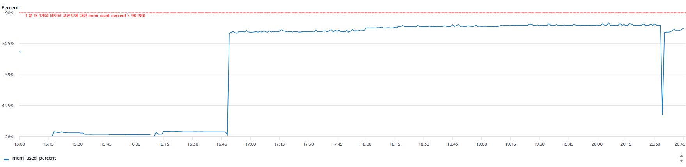
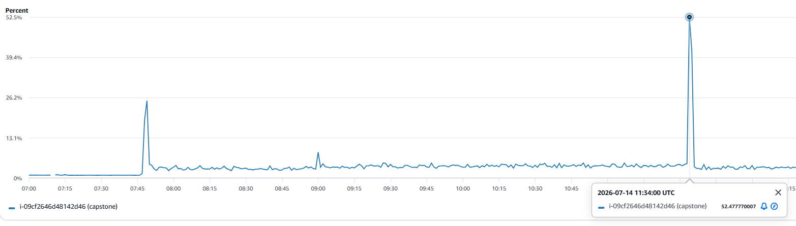

# 순수 idle 상태에서 발생한 커널 OOM-kill 분석

배포 서버의 idle 상태에 대한 관찰 도중 실제로 포착한 커널
OOM-killer 발동 기록이다. 유저·GPS 데이터가 전혀 없고 외부 요청도 전혀 없는 상태에서,
배포 3시간 44분 만에 자연 발생했다.

## 배경 — 이 사건이 나온 조건

- **무방어 이미지**(`Dockerfile.oom-repro`): `-Xmx`/`MaxRAMPercentage`/
  `ExitOnOutOfMemoryError` 등 JVM 방어 플래그 전부 제거.
- **무방어 compose**(`docker-compose.prod.before.yml`): 컨테이너 `mem_limit` 없음.
- **RDS 완전히 비어 있음**: 유저 0명, GPS 포인트 0건. 외부 HTTP 요청도 전혀 주지 않음 —
  스케줄러(`CareSseHeartbeatScheduler` 30초·`DependentWatchingResendScheduler` 5분·
  `OngoingStayTailScheduler` 10분)만 빈 컬렉션을 대상으로 계속 실행되는 순수 idle 상태.
- **배포 시각**: 2026-07-14 07:50 UTC → **사건 발생까지 3시간 44분**.

## 타임라인



| 시각(UTC)      | mem_used_percent  | mem_available    | CPUUtilization | 사건                 |
|--------------|-------------------|------------------|----------------|--------------------|
| 07:50        | ~79~80%           | -                | -              | 배포 직후              |
| 11:20~11:33  | 83.6% 평탄          | ~20~29MB         | 3.5~4.7%       | 사건 직전 baseline     |
| **11:34:34** | **38.65%(1분 평균)** | **428MB(1분 평균)** | **52.5%**      | **OOM-kill 발생 순간** |
| 11:35        | 80.0%             | 46MB             | 41.4%          | 재시작된 JVM 부팅 중      |
| 11:36~       | 3%대로 복귀           | -                | 3%대 복귀         | 부팅 완료, CPU 진정      |
| 11:36~11:49  | 80~82%로 재안정       | 33~46MB          | 3%대            | 새 프로세스 기준 정상 상태    |

`mem_used_percent`가 11:34분 한 구간만 38%로 급락한 건 **메모리가 남아돌았다는 뜻이 아니라
정반대다** — 이 1분 평균 구간 안에 "OOM-kill로 507MB 힙을 가진 java 프로세스가 즉사 →
`restart:always`로 새 프로세스가 거의 0MB에서 재출발"이 통째로 들어가 있어, 그 구간의
평균값이 착시처럼 낮게 찍힌 것이다. `mem_available`이 같은 구간 428MB로 튄 것도 같은 이유
(죽은 프로세스가 자기 메모리를 즉시 반납).

## `mem_used_percent`와 `mem_available`이 다른 이유

두 지표 모두 CloudWatch Agent가 EC2 게스트 OS의 `/proc/meminfo`에서 읽어가지만, 계산에
쓰는 필드가 다르다.

```
mem_used_percent = (total - free - buffers - cache) / total × 100   ← free -m의 "used" 컬럼
mem_available     = 커널이 /proc/meminfo의 MemAvailable로 직접 계산 ← "지금 즉시 회수 가능한 양"만 반영
```

`mem_used_percent`는 `buff/cache`를 통째로 "안 쓴 것"으로 간주해 계산하기 때문에,
캐시가 실제로 회수 가능한지는 반영하지 못한다. 반면 `mem_available`은 커널이 각 캐시
페이지의 회수 가능 여부(활성/비활성, dirty 여부 등)까지 따져서 "새 할당에 즉시 쓸 수
있는 양"만 정직하게 보여준다.

이번 사건 직전(11:33) `buff/cache`가 이미 수십 MB 수준까지 말라 있어 회수할 여지가 거의
없었는데도, `mem_used_percent`는 83.6%에서 계속 평탄하게 유지되며 이 위험을 전혀 반영하지
못했다. 반대로 `mem_available`은 20~29MB까지 떨어지며 위험을 먼저 보여주고 있었다 —
**이 사건에서는 `mem_available`이 `mem_used_percent`보다 훨씬 더 신뢰할 수 있는 조기
경보 지표였다.**

## 무엇이 방아쇠를 당겼나

`kern.log`의 첫 줄이 트리거를 그대로 알려준다.

```
run3-watch.sh invoked oom-killer: gfp_mask=0x140cca(...), order=0, oom_score_adj=0
```

역설적으로 **이 실험을 관찰하려고 띄워둔 워처 스크립트(`run3-watch.sh`, 15초마다
`free`/`docker inspect` 호출) 자신의 페이지 폴트가 트리거**였다. 사건 당시 시스템 free
메모리는 DMA32 존 기준 `free:12124`페이지(≈47MB)까지 말라 있었고
(`slab_reclaimable:2559`페이지≈10MB, `dirty:0 writeback:0`으로 즉시 회수 가능한 페이지도
거의 없음), 워처가 새 프로세스를 fork하며 필요로 한 작은 페이지 할당 하나가 그 마지막
여유를 넘겨 `__alloc_pages_slowpath` → `out_of_memory()` → `oom_kill_process()`를
호출시켰다.

## 커널이 왜 java를 골랐는가 (`oom_score_adj` 기반 후보 선정)

리눅스 OOM-killer는 각 프로세스에 대해 대략 다음 점수를 계산해, **가장 높은 점수**를 가진
프로세스를 죽인다.

```
raw_score  = (RSS + swap + 페이지테이블) / 전체 물리 메모리 × 1000
final_score = raw_score + oom_score_adj   (-1000이면 사실상 면제)
```

사건 당시 `/proc/[pid]/oom_score_adj`와 RSS(전체 913MB 기준)를 정리하면:

| 프로세스                       | RSS                   | raw_score(≈) | oom_score_adj | 비고                           |
|----------------------------|-----------------------|--------------|---------------|------------------------------|
| **java (myapp, pid 1565)** | **508,744kB(≈497MB)** | **≈557**     | **0(무보정)**    | **희생양으로 선택**                 |
| amazon-cloudwatch-agent    | 26MB                  | ≈29          | **-1000**     | 관측자 자기보호(Phase B에서 명시적으로 설정) |
| dockerd                    | 27MB                  | ≈30          | -500          | Docker 자체 기본값                |
| containerd                 | 17MB                  | ≈19          | -999          | Docker 자체 기본값                |
| containerd-shim            | 3.6MB                 | ≈4           | -998          | Docker 자체 기본값                |
| sshd                       | 4.6MB                 | ≈5           | -1000         | 배포판 기본값(원격 접속 보호)            |
| run3-watch.sh(트리거 자신)      | 2.1MB                 | ≈2           | 0             | 너무 작아 후보에서 배제                |

java는 ① 유일하게 `oom_score_adj` 보정을 전혀 받지 못했고(무방어 이미지의 의도된 설계),
② 설령 보정이 없었다는 조건이 같았어도 RSS가 시스템 전체 메모리의 절반을 넘어 raw_score
자체가 다른 모든 프로세스를 압도했다. 두 조건이 겹쳐 "필연적으로" 선택된 것이다.

```
oom-kill: constraint=CONSTRAINT_NONE, ..., task_memcg=/system.slice/docker-78fadb...scope,
          task=java, pid=1565, uid=0
Out of memory: Killed process 1565 (java) total-vm:2840572kB, anon-rss:508744kB, ...
```

`constraint=CONSTRAINT_NONE`이 이 사건의 성격을 규정한다 — 컨테이너 `mem_limit`(cgroup)
때문에 죽은 게 아니라, **호스트 전체가 메모리 부족에 빠져 전역(global) OOM-killer가
발동**한 것이다. 컨테이너 경계가 없는 "진짜 무방어" 상태의 clean kill을 실기기에서 확인한
첫 사례다.

## 재시작 이후

`docker-events` 로그가 즉시 이어진다.

```
container/die   name=myapp exitCode=137   (SIGKILL, OOM-killer 서명)
container/start name=myapp                (restart:always로 즉시 재기동)
```

새 java 프로세스는 거의 0에서 시작해 Spring Boot 부팅(클래스 로딩·JIT 워밍업)을 거치며
11:34~11:35 구간 CPU를 40~52%까지 밀어올렸고, 이후 5분 정도에 걸쳐 `mem_used_percent`가
80~82%로 재안정됐다. 재시작 이전 baseline(83.6%)보다 살짝 낮은 수준에서 다시 시작한
것으로 보아, 새 프로세스는 아직 이전 프로세스가 수 시간에 걸쳐 쌓았던 힙 조각·캐시를
갖고 있지 않다.

## CPU 사용률이 함께 오른 이유



11:34(52.5%)→11:35(41.4%)→11:36(3%대 복귀)로 이어지는 스파이크는 두 단계가 한 구간에
섞여 있다.

- **1단계(매우 짧음)**: kill 직전 `__alloc_pages_slowpath`가 회수 가능한 페이지를 찾으려고
  LRU를 스캔하는 비용. `oom_kill_process()`가 밀리초~수 초 안에 호출됐으니 이 자체의
  기여는 작다.
- **2단계(진짜 원인)**: `restart:always`로 즉시 재기동된 **새 JVM의 콜드 스타트**. 수천 개
  클래스를 처음부터 로딩·검증하고, JIT가 아직 안 데워져 인터프리터/C1 컴파일로 실행되며,
  Spring 컨텍스트 초기화(리플렉션 기반 컴포넌트 스캔, Hibernate EntityManagerFactory 빌드,
  HikariCP 워밍업, 내장 Tomcat 바인딩)가 전부 순수 CPU 바운드로 발생한다. 이 부팅 작업
  다수가 메인 스레드 위주라, t3.micro의 vCPU 2개 중 1개가 거의 풀가동된 수준(52%)과
  맞아떨어진다. 약 2분 지속 후 3%대로 복귀한 시점이 부팅 완료 시점이다.

CPU 크레딧 지표로도 "짧고 가벼운 스파이크"였음이 확인된다(5분 단위 기본 지표라 사건이
낀 버킷은 11:36으로 찍힌다).

| 시각(UTC)             | CPUCreditBalance   | CPUCreditUsage  |
|---------------------|--------------------|-----------------|
| 11:31               | 46.99              | 0.40(베이스라인)     |
| **11:36(사건 포함 버킷)** | **45.85(≈1.1 소진)** | **2.14(≈5.5배)** |
| 11:41               | 46.52(재상승)         | 0.33(베이스라인 복귀)  |

`CPUSurplusCreditBalance`는 전 구간 0(`credit_specification.cpu_credits = "standard"`이라
서플러스를 끌어쓰지 않음). 소진량이 크레딧 잔량 대비 미미하고 즉시 회복된 것으로 보아,
이 CPU 상승은 "메모리가 없어서"가 아니라 "죽은 프로세스를 대신할 새 프로세스가 처음부터
부팅하느라" 생긴 일회성 비용이다.

**한줄 요약**

```aiignore
OOM-killer가 발동해 myapp 컨테이너의 java 프로세스가 죽었고, restart:always로 즉시 재시작됐다
```

## 증거 파일

- `kern-log-oom-2026-07-14-1134.txt` — 커널 OOM 블록 전체(프로세스 테이블·oom-kill 판정
  라인 포함) + docker-events die/start.
