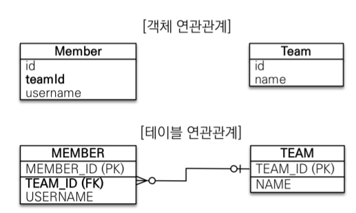

## 문제 상황

```java
Optional<DayRoute> findByUserIdAndDate(Long userId, LocalDate date);
```

dayRoute를 조회하기 위해 위와 같은 jpa 쿼리 메서드를 사용했고 실제 db로 나가는 쿼리는 다음과 같았다.

```sql
select dr1_0.day_route_id,
       dr1_0.date,
       dr1_0.deleted,
       dr1_0.end_time,
       dr1_0.is_bookmarked,
       dr1_0.memo,
       dr1_0.start_time,
       dr1_0.title,
       dr1_0.total_distance,
       dr1_0.user_id
from day_route dr1_0
         left join
     users u1_0
     on u1_0.user_id = dr1_0.user_id
where u1_0.user_id = 1
  and dr1_0.date = '2026-03-02';
```

예상치 못하게 users 테이블과 조인이 발생했다. 오로지 dayRoute만 조회하는 쿼리였기에 where 절로 user_id와 date의 필드만으로 필터링하여 조회가 발생할
것이라고 예상했다.

---

## 쿼리 메서드는 왜 이런 불필요한 조인을 만들어낼까?

jpa의 쿼리 메서드의 동작 원리를 파악하기 위해 spring data jpa의 공식문서를 찾아봤다.

> Property expressions can refer only to a direct property of the managed entity, as shown in the
> preceding example. At query creation time, you already make sure that the parsed property is a
> property of the managed domain class. However, you can also define constraints by traversing
> nested
> properties.

요약하자면 **쿼리 메서드의 속성 표현식은 관리되는 엔티티의 직접적인 속성만 참조 가능**하다는 것이다. 만약 중첩 엔티티 속성이 존재하다면 다음과 같은 동작방식을 따른다.

1. 메서드 이름을 해당 엔티티의 속성으로 해석하고 해당 도메인에 해당 속성이 존재하는지 확인한다.
2. 그렇지 않으면 오른쪽부터 카멜 케이스 기준으로 헤드와 테일을 분할한다.
3. 헤드를 엔티티로 해석하고 테일을 속성으로 해석하여 해당 엔티티에 해당 속성이 존재하는지 확인한다.
4. 일치하는 속성을 찾지 못하면 분할 기준을 왼쪽으로 이동하여 카멜케이스를 기준으로 또 분할하여 동일한 알고리즘을 사용하여 트리를 계속 구축한다.

예를 들어 다음과 같은 쿼리 메서드가 있다고 해보자. 동작 방식은 아래와 같다.

```java
List<Person> findByAddressZipCode(ZipCode zipCode);
```

1. Person의 addressZipCode 속성이 있는지 확인한다.
   2.`AddressZip | Code`로 분할하여 Person에 addressZip이라는 필드가 있는지 확인한다. 있다면 addressZip 타입에서 code 필드를 찾는다.
   3`Address | ZipCode`로 분할하여 Person에 address 필드가 있는지, 있다면 address 타입에서 zipCode 필드를 찾는다.

엔티티와 그에 알맞는 속성을 찾지 못할 경우 카멜케이스의 분해지점을 오른쪽에서 왼쪽으로 이동한다.

## 내 경우를 해석해보자!

```java
Optional<DayRoute> findByUserIdAndDate(Long userId, LocalDate date);
```

내 쿼리 메서드명에서 알고리즘을 일단 DayRoute 엔티티에서 userId 필드와 date 필드를 찾으려 했을 것이다.

DayRoute는 userId라는 필드를 직접적으로 가지고 있지 않으니 UserId를 `User | Id` 로 분할하여 user라는 엔티티에서 id라는 속성을 찾았을 것이다. 나의
경우에 User 엔티티와 그 엔티티가 id라는 속성을 가지고 있기 때문에 jpa가 userId를 DayRoute가 참조하는 User 엔티티의 id로 해석한 것이다. 따라서 jpa는
User의 id를 참조하기 위해 User 테이블과 조인하는 방식을 택한 것이다.

## jpa의 엔티티가 외래키 필드를 그대로 가지지 않는 이유가 뭘까?

이처럼 jpa는 dayRoute의 userId를 외래키 필드로 해석하지 않고 dayRoute와 연관관계가 맺어진 User의 id로 해석했다. 엔티티는 왜 userId를 직접 외래키
필드로 갖지 않고 User 엔티티를 그대로 참조하는 방식을 사용해서 객체 그래프 탐색으로 하여금 불필요한 조인을 만들어내는 건지, jpa의 이러한 방식이 주는 이점이 무엇일지
궁금해졌다.

```java

@Entity
public class DayRoue {

    private Long userId;
}
```

> 테이블 설계 방식을 따라가서 위와 같이 외래키 필드를 그대로 가지고 있으면 어디 덧나나?
> 굳이 jpa에서 테이블 설계 방식을 따라가지 않는 이유는 뭐까?

JPA의 정의를 살펴보자. JPA는 ORM(Object-Relationoal Mapping, 객체 관계 매핑) 기술로 **객제 지향 프로그래밍 언어의 객체와 관계형 데이터베이스의
테이블을 자동으로 연결해 주는 기술**이다. 즉 애플리케이션에서 사용하는 객체 지향 언어와 관계형 db에는 패러다임의 불일치가 존재하고 이 사이의 간격을 jpa가 메워준다는
의미이다.

> 만약 엔티티가 외래키를 그대로 사용한다면 어떻게 될까?

테이블의 외래키를 객체에 그대로 가져와서 객체 설계를 테이블 설계에 맞춰보자. 다음과 같이 말이다.



```java

@Entity
public class Member {

    @Id
    @GeneratedValue
    private Long id;
    private String teamId;
}

@Entity
public class Team {

    @Id
    @GeneratedValue
    private Long id;
    private String name;
}
```

```java
//팀 저장
Team team = new Team();
team.setName("TeamA");
em.persist(team);

//회원 저장
Member member = new Member();
member.setName("member1");
member.setTeamId(team.getId());
em.persist(member);

//조회
Member findMember = em.find(Member.class, member.getId());
//연관관계가 없음
Team findTeam = em.find(Team.class, team.getId());
```

생각해보니 Member와 Team 사이에는 연관관계가 없다. `findMember.getTeam()` 과 같은 **객체 그래프 탐색이 불가능하다!!!!** 따라서 애플리케이션
개발자는 sql을 사용하듯이, member와 team에 대한 질의를 각자 따로 던져야 한다.

객체를 테이블에 맞추어 데이터 중심으로 모델링하면, 협력 관계를 만들 수 없다.

- **테이블은 외래 키로 조인**을 사용해서 연관된 테이블을 찾는다.
- **객체는 참조**를 사용해서 연관된 객체를 찾는다.
- 테이블과 객체 사이에는 이런 큰 간격이 있다.

> 객체지향 설계의 목표는 자율적인 객체들의 협력 공동체를 만드는 것이다.  
> -조영호 (객체지향의 사실과 오해)

jpa는 객체들 사이의 협력 관계를 만들기 위해 객체 설계를 테이블 설계에 그대로 맞추지 않았다. 생각해보면 객체 지향 프로그래밍에는 sql처럼 조인이라는 개념이 존재하지 않는다.
예시와 같이 엔티티가 외래키 필드를 직접 소유한다면 애플리케이션 단에서 엔티티가 외래키 필드로 조인을 하는 게 불가능하기 때문에 참조가 아예 없는 셈이고 따라서 **연관관계가 아예
존재하지 않는다.**

---

## 해결 방법

### 1. 연관관계의 엔티티를 매개변수로 사용

외래키인 userId 값으로 조회하지 않고 연관 관계에 있는 엔티티를 그대로 매개변수로 넣어주면 조인을 사용하지 않는다.

```java
Optional<DayRoute> findByUserAndDate(User user, LocalDate date);
```

**jpa가 연관 엔티티를 식별자 값, 즉 외래키로 치환에서 비교**할 수 있기 때문에 조인을 하여 객체 그래프 탐색을 하지 않는다. 하지만 User 엔티티를 매개변수로 넘겨주기
위해 id로 User 엔티티를 조회해오는 쿼리를 따로 추가하고 싶진 않았다. 이 방법은 패스.

### 2. JPQL

쿼리 메서드 대신에 JPQL을 사용하면 userId 필드를 그대로 where 절에 사용하여 조인을 발생시키지 않는다.

```java
@Query("""
        select dr
        from DayRoute dr
        where dr.user.id = :userId
          and dr.date = :date
    """)
Optional<DayRoute> findByUserIdAndDate(@Param("userId") Long userId,
    @Param("date") LocalDate date);
```

발생하는 쿼리는 다음과 같다.

```sql
select dr1_0.day_route_id,
       dr1_0.date,
       dr1_0.deleted,
       dr1_0.end_time,
       dr1_0.is_bookmarked,
       dr1_0.memo,
       dr1_0.start_time,
       dr1_0.title,
       dr1_0.total_distance,
       dr1_0.user_id
from day_route dr1_0
where dr1_0.user_id = ?
  and dr1_0.date = ?
```

이외에도 native 쿼리를 사용할 수도 있겠지만 이왕 jpa를 사용한 김에 jpa의 기능을 적극 활용하고 싶었기에 위 방법을 채택했다.


## 배운 점

왜 jpa의 쿼리 메서드가 불필요한 조인을 발생시키는가에 대한 궁금증에서 시작해 jpa 공식 문서를 처음으로 읽어보면서 jpa가 쿼리 메서드를 어떤 매커니즘으로 sql 쿼리로
변환시키는지 알아봤다.

쿼리 메서드의 객체 탐색 매커니즘 공부해보니 jpa의 객체 탐색이 오히려 불필요한 조인을 만든다고 생각하여 jpa는 왜 이런식으로 설계되었는지, 이러한 설계 방식이 주는 이점이
무엇인지가 궁금해졌다. jpa가 왜 등장했는지를 알기 위해 기본 정의부터 뜯어봤다. 이 과정에서 김영한님의 jpa 개념 강의 자료를 많이 읽었다. 자주 사용해왔던 jpa인데도
이때까지 rdb의 테이블 설계와 jpa의 객체 설계가 어떻게 다른지, 관계형 데이터베이스와 객체지향 언어 간의 패러다임의 간격을 orm 기술이 어떻게 메꿔주는지도 잘 모르고
사용했었다.

이번 계기로 jpa의 객체 패러다임과 객체지향 관점에서 객체 간의 협력 관계에 대해 더 잘 이해할 수 있었다. 사소한 성능 이슈였지만 이것저것 공부하느라 시간이 꽤 걸렸다.
jpa는 애플리케이션 개발자에게 편리성을 준다. sql이나 rdb에 대해 잘 몰라도 우리에게 친숙한 객체 지향 언어로 바꿔주기 때문이다. 하지만 어떤 기술이 우리에게 편리함을
줄수록 그 기술을 더 경계하면서 사용할 필요가 있는 것 같다. 기술을 잘 알지 못한 채 사용을 남발하면 성능 이슈 등의 부작용이 발생할 확률이 크기 때문이다. 이번 이슈도 jpa의
객체 그래프 탐색 방식을 잘 몰랐고 jpa에서 엔티티 간의 연관관계를 RDB 테이블에서의 외래키 관계로 멋대로 해석해서 발생한 이슈였다. 어떤 기술을 사용할 땐 그 기술이 주는
편리성만 이용하지 않고 **그 기술을 잘 아는가, 그 기술의 매리트는 무엇인가를 충분히 공부해봐야겠다.**
